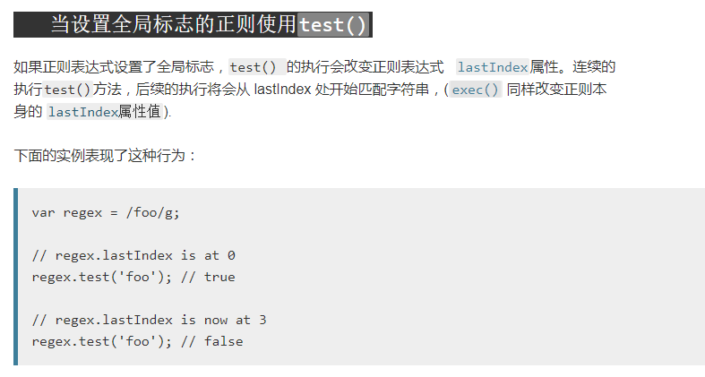

# regexp-test

1.  匹配出id： \<div id="container" class="main"></div>

    * 不仅匹配了id，还匹配了class
    ```js
    var regex = /id="[^]*"/g;
    var string = '<div id="container" class="main"></div>';
    string.match(regex); // [id="container" class="main"]
    ```
     
    * 惰性匹配，会回溯，效率不是最高
    ```js
    var regex = /id="[^]*?"/g;
    var string = '<div id="container" class="main"></div>';
    string.match(regex); // ["id="container""]
    ```
    * 最后
    ```js
    var regex = /id="[^"]*"/g;
    var string = '<div id="container" class="main"></div>';
    string.match(regex); // ["id="container""]
    ```

2. 数字的千位分隔符

    ```js
    var regex = /(?!^)(?=(\d{3})+$)/g;
    var string = '123123123';
    string.replace(regex, ','); // 123,123,123
    ```
    
3. 匹配日期格式2020.03.12或者2020-03-12

    ```js
    var regex = /^\d{4}([\-\.]{1})\d{2}\1\d{2}$/g;
    var string1 = '2020.03.12';
    var string2 = '2020-03.12';
    var string3 = '2020-03-12';
    regex.test(string1); // true
    regex.test(string2); // false
    regex.test(string3); // true
    ```

4、当设置全局标志的正则使用test()

   ```js
    var regexp = /a/g;
    var string1 = 'a';
    console.log(regexp.test(string1)); // true
    console.log(regexp.test(string1)); // false
    console.log(regexp.test(string1)); // true
    console.log(regexp.test(string1)); // false
   ```
   ;
